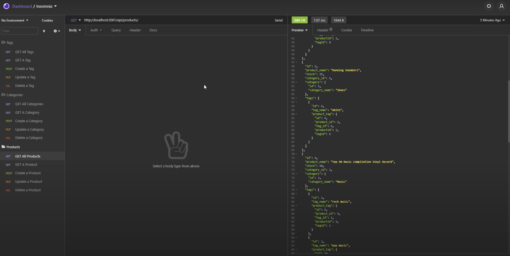

# ecommerce_back_end

This application enables users to create and maintain a database of online products. The database system consists of three main tables called products, categories and tags as well as a through table called ProductTags.

The relationships between these tables are as follows:

- Each Product has a Category
- Each Product can have many Tags
- Each Tag can have many Products

The application enables a user to Create, Read, Update and Delete entries from the three main tables listed above through various API endpoints. The application also contains a seeding file to help you get started using the program

A video walkthrough of the application can be found [here](https://youtu.be/3qLvxGwMNS0).

## List of Technologies
- Node.js
- Sequelize
- MySQL
